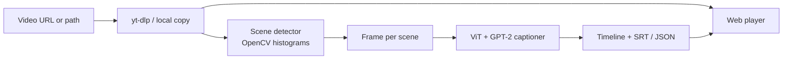

# Veauido

**Veauido** turns video URLs into timestamped, per-scene captions using scene detection and a ViT + GPT-2 image captioning model. Paste a YouTube or direct video link, and the app downloads the clip, splits it into visual scenes, captions a representative frame from each scene, and presents an interactive timeline you can export as SRT or JSON.

**Live demo:** [https://veauido.onrender.com](https://veauido.onrender.com)  
**Local:** [http://localhost:8000](http://localhost:8000) after running the server

---

## Demo

32-second sample from [this source video](https://www.youtube.com/watch?v=MDaZ31jx2vQ), processed through the full Veauido pipeline. Captions are burned into the clip below; the matching SRT and JSON live in `docs/demo/`.

<video src="docs/demo/captioned-demo.mp4" controls width="100%" style="max-width: 880px; border-radius: 12px; border: 1px solid #d8e0ec;"></video>

| Time | Caption |
|------|---------|
| 0.0s – 2.9s | a person holding a cell phone in front of a keyboard |
| 2.9s – 6.2s | a person holding a cell phone in their hand |
| 6.2s – 10.6s | a black and white sign on a black and white screen |
| 10.6s – 19.2s | a black and white photo of a white bird |
| 19.2s – 32.0s | a large group of people sitting in a room |

Download assets: [`captioned-demo.mp4`](docs/demo/captioned-demo.mp4) · [`captions.srt`](docs/demo/captions.srt) · [`captions.json`](docs/demo/captions.json)

Regenerate the demo clip after processing a new video:

```bash
python scripts/make_demo.py
```

---

## How it works

Veauido runs a four-stage pipeline for every request:

1. **Acquire** — Download remote URLs with [yt-dlp](https://github.com/yt-dlp/yt-dlp) (with browser impersonation for Cloudflare-protected links), or copy a local file / `file://` path into `videos/`.
2. **Detect scenes** — Sample frames at 2 FPS, compare HSV color histograms between samples, and mark large visual changes as scene boundaries (minimum scene length: 1.5s).
3. **Caption frames** — Extract one representative frame per scene, resize to 224×224, and run `nlpconnect/vit-gpt2-image-captioning` (ViT encoder + GPT-2 decoder).
4. **Return timeline** — Respond with timestamped captions, a playable video URL, and export options in the web UI.



### Web UI

The frontend is a single-page app served by FastAPI. After captioning:

- The video plays with a live caption overlay synced to the timeline.
- Click any caption row to jump to that scene.
- Export **SRT** or **JSON** from the results panel.
- Recent URLs are stored in browser history (up to 8 entries).

---

## Quick start

### Prerequisites

- Python 3.10+
- `pip`
- Optional: [ffmpeg](https://ffmpeg.org/) (helps yt-dlp merge some formats; not required for basic MP4 downloads)

### Install

```bash
git clone <your-repo-url>
cd Veauido
pip install -r requirements.txt
pip install "yt-dlp[default,curl-cffi]"   # Cloudflare / impersonation support
```

### Run the web app

```bash
python run.py serve
```

Open [http://localhost:8000](http://localhost:8000), paste a video URL, and click **Generate Captions**.

First startup downloads the captioning model (~500 MB) into `.cache/`. Loading on CPU takes a minute or two.

### CLI (single video)

```bash
python run.py caption --url "https://www.youtube.com/watch?v=MDaZ31jx2vQ"
```

Prints a human-readable timeline and full JSON to stdout.

---

## API

| Endpoint | Method | Description |
|----------|--------|-------------|
| `/` | GET | Web UI |
| `/api/health` | GET | Readiness probe (`model_loaded`, `status`) |
| `/api/site` | GET | Public URL and API endpoint list |
| `/api/caption` | POST | Run the full pipeline |
| `/videos/{id}.mp4` | GET | Processed video files |

### `POST /api/caption`

**Body**

```json
{
  "url": "https://www.youtube.com/watch?v=MDaZ31jx2vQ"
}
```

**Response**

```json
{
  "success": true,
  "video_id": "3554997212b3",
  "video_serve_url": "/videos/3554997212b3.mp4",
  "duration": 91.6,
  "captions": [
    { "start": 0.0, "end": 2.9, "text": "a person holding a cell phone in front of a keyboard" },
    { "start": 2.9, "end": 6.2, "text": "a person holding a cell phone in their hand" }
  ],
  "processing_time": 44.0
}
```

**Example**

```bash
curl -X POST http://localhost:8000/api/caption \
  -H "Content-Type: application/json" \
  -d '{"url": "https://www.youtube.com/watch?v=MDaZ31jx2vQ"}'
```

---

## Configuration

Environment variables (all optional):

| Variable | Default | Description |
|----------|---------|-------------|
| `VEAUIDO_HOST` | `0.0.0.0` | Server bind host |
| `VEAUIDO_PORT` / `PORT` | `8000` | Server port (`PORT` used on Render/Railway) |
| `VEAUIDO_PUBLIC_URL` | auto | Public site URL for deploy links |
| `VEAUIDO_MODEL_NAME` | `nlpconnect/vit-gpt2-image-captioning` | Hugging Face model ID |
| `VEAUIDO_DEVICE` | `cpu` | PyTorch device (`cuda` if GPU available) |
| `VEAUIDO_SCENE_THRESHOLD` | `0.4` | Histogram difference threshold for scene cuts |
| `VEAUIDO_MIN_SCENE_DURATION` | `1.5` | Minimum scene length (seconds) |
| `VEAUIDO_MAX_DOWNLOAD_SIZE` | `100M` | yt-dlp download size limit |
| `VEAUIDO_MAX_CAPTION_LENGTH` | `50` | Max tokens per caption |

---

## Deployment

Docker and Render are preconfigured:

```bash
docker build -t veauido .
docker run -p 8000:8000 -e VEAUIDO_PUBLIC_URL=https://your-domain.com veauido
```

**Render (Blueprint):** push to GitHub, connect the repo on [Render](https://render.com), and deploy with `render.yaml`. Default URL: [https://veauido.onrender.com](https://veauido.onrender.com).

The free tier has cold starts and limited RAM; video captioning may need a paid instance for reliable runs.

---

## Project structure

```
Veauido/
├── config.py              # Settings and paths
├── run.py                 # CLI entry (`serve`, `caption`)
├── requirements.txt       # Local dependencies
├── requirements-docker.txt
├── Dockerfile
├── render.yaml
├── frontend/              # Static web UI (HTML, CSS, JS)
├── server/
│   └── app.py             # FastAPI app and API routes
├── model/
│   ├── pipeline.py        # Download → scenes → captions
│   ├── scene_detector.py  # OpenCV histogram scene detection
│   └── captioner.py       # ViT + GPT-2 wrapper
├── scripts/
│   └── make_demo.py       # Build docs/demo captioned clip
├── docs/demo/             # README demo video and caption files
├── videos/                # Downloaded / copied videos (runtime)
└── .cache/                # Model weights (runtime)
```

---

## Model

Veauido uses [**nlpconnect/vit-gpt2-image-captioning**](https://huggingface.co/nlpconnect/vit-gpt2-image-captioning) from Hugging Face:

- **Encoder:** Vision Transformer (ViT) for image features
- **Decoder:** GPT-2 for natural-language captions
- **Input:** One 224×224 RGB frame per scene
- **Output:** Short English description (e.g. “a dog running on a beach”)

Captions describe individual frames, not full scene motion or audio. Quality depends on how representative the chosen frame is for each scene.

---

## Troubleshooting

| Issue | Fix |
|-------|-----|
| `Cloudflare anti-bot challenge` from yt-dlp | `pip install "yt-dlp[default,curl-cffi]"` and restart the server |
| Model slow on first run | Normal — weights download to `.cache/` on first launch |
| `503 Model is not loaded` | Check server logs; startup failed during model load |
| Video won't play in browser | Ensure the downloaded file is a readable MP4 (pipeline validates with OpenCV) |

---

## License

Add your license here if you plan to open-source the project.
